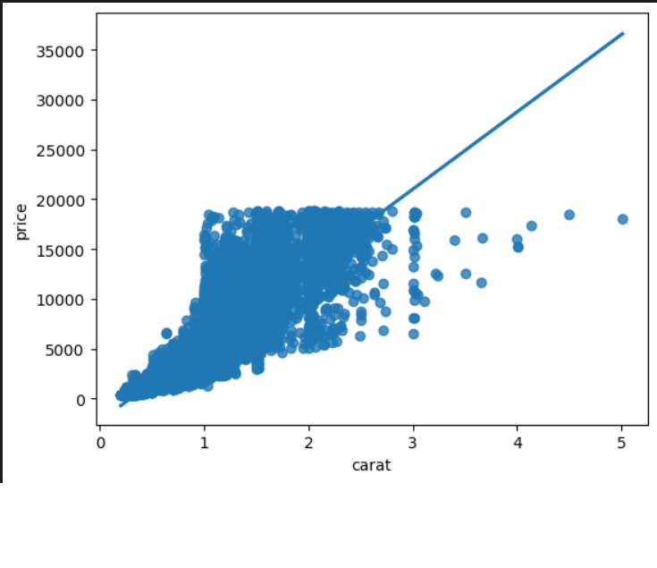
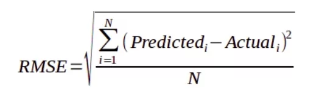

# Laporan Proyek Machine Learning

### Nama : Mega Dwi Rengganis

### Nim : 211351081

### Kelas : TIF Pagi A

## Domain Proyek


Diamond atau intan adalah benda berharga mineral yang merupakan bentuk kristal atau alotrop dari karbon. Kemurnian dan kesempurnaan struktur kristal menjadikan berlian bening dan jernih, di mana kekerasan, dispersi optis, dan kestabilan kimia menjadikannya batu perhiasan yang sangat populer. Diamond sangat berharga karena keunikan dan keindahannya. Diamond memiliki kemampuan untuk memantulkan cahaya dengan sangat baik, sehingga menghasilkan kilauan yang indah. Selain itu, Diamond juga memiliki sifat kekerasan yang sangat tinggi, sehingga sulit untuk diukir atau diubah bentuknya. Kombinasi antara kemampuan memantulkan cahaya dan kekerasan yang tinggi menjadikan diamond sebagai batu permata yang sangat populer dan mahal. Karena mahalnya harga diamond maka ketika ingin membelinya, konsumen harus dapat memperhatikan detail-detail benda tersebut dengan baik, guna dapat membeli sesuai dengan harga.

Dengan perkembangan teknologi dan informasi, terutama dalam hal algoritma pembelajaran mendalam (deep learning) dan machine learning, kita dapat membuat mesin yang dapat meramalkan harga diamond dengan akurasi yang dapat dipercaya sehingga membantu para pembeli untuk membeli diamond dengan harga yang tepat

## Business Understanding

### Problem Statements

- Mahalnya harga diamond sehingga ketika ingin membelinya perlu memperhitungkan banyak hal.
- Konsumen kerap kesusahan untuk memperkirakan harga diamond karena perlu ketelitian yang sangat tinggi.

### Goals

- Konsumen dapat memperkirakan harga diamond sesuai spesifikasi diamond tersebut.

### Solution statements

- Membangun suatu sistem yang dapat mempelajari suatu data (Machine Learning) melakukan estimasi harga diamond sesuai spesifikasi
- Sistem berjalan dengan menggunakan metode Regresi Linear yang dinilai cocok untuk melakukan estimasi.

## Data Understanding

Dataset yang digunakan berasal dari situs Kaggle. Dataset ini mengandung 50000 entries dan 10 columns<br>

Link Dataset: [Diamond Price](https://www.kaggle.com/datasets/amirhosseinmirzaie/diamonds-price-dataset).

### Variabel-variabel yang terdapat pada Dataset adalah sebagai berikut:

- Carat = Berat berlian dalam karat
- Cut = Kualitas potongan berlian ('Ideal','Premium','Good','Very Good','Fair')
- Diamond Color = Warna diamond dari J(terburuk) ~ D(Terbaik)
- clarity = Ukuran kejernihan berlian (dari kiri ke kanan adalah yang terburuk hingga yang terbaik: I1, SI2, SI1, VS2, VS1, VVS2, VVS1, IF)
- x = panjang diamond
- y = tinggi diamond
- z = ketebalan/kedalaman diamond
- depth = z / mean(x,y)
- table = Lebar titik terlebar di bagian atas berlian
- diamond price = harga diamond

## Data Preparation

Pertama-tama import semua library yang dibutuhkan,

```bash
import pandas as pd
import numpy as np
import matplotlib.pypot as plt
import seaborn as sns
```

Setelah itu kita akan men-definsikan dataset menggunakan fungsi pada library pandas

```bash
df = pd.read_csv('diamonds.csv')
```

Lalu kita akan melihat informasi mengenai dataset dengan syntax seperti dibawah:

```bash
df.info()
```

Dengan hasil sebagai berikut:

```bash
<class 'pandas.core.frame.DataFrame'>
RangeIndex: 50000 entries, 0 to 49999
Data columns (total 10 columns):
 #   Column   Non-Null Count  Dtype
---  ------   --------------  -----
 0   carat    50000 non-null  float64
 1   cut      50000 non-null  object
 2   color    50000 non-null  object
 3   clarity  50000 non-null  object
 4   depth    50000 non-null  float64
 5   table    50000 non-null  float64
 6   price    50000 non-null  int64
 7   x        50000 non-null  float64
 8   y        50000 non-null  float64
 9   z        50000 non-null  float64
dtypes: float64(6), int64(1), object(3)
memory usage: 3.8+ MB
```

<br>

Kita juga akan melihat tingkat korelasi antar kolom


Korelasi antar kolom perlu diperhatikan guna memilih feature dengan tepat

Selanjutnya memeriksa apakah ada data yang berisi nilai null pada dataset:

```bash
df.isna().sum()
```

Dengan hasil sebagai berikut:

```bash
carat      0
cut        0
color      0
clarity    0
depth      0
table      0
price      0
x          0
y          0
z          0
dtype: int64
```

 <br>

Setelah memeriksa bahwa dataset yang kita gunakan tidak terdapat nilau null / NaN, maka tahap cleaning tidak diperlukan.

### Mengganti kolom kategori menjadu numerik

kita perlu merubah kolom yang berisi kategori seperti cut, color dan clarity menjadi numerik agar dapat dijadikan feature.

#### Merubah kolom cut menjadi numerik

Kita akan memeriksa value apa saja yang bukan numerik yang ada di kolom cut

```bash
y = [x for x in df['cut'] if x.isnumeric() == False]
print(y)
```

> ['Ideal', 'Premium', 'Good', 'Premium', 'Good', 'Very Good', 'Very Good', 'Very Good', 'Fair', 'Very Good', 'Good', 'Ideal', 'Premium', 'Ideal', 'Premium', 'Premium', 'Ideal', 'Good', 'Good', 'Very Good', 'Very Good', 'Very Good', 'Very Good', 'Very Good', 'Very Good', 'Premium', 'Very Good', 'Very Good', 'Very Good', 'Very Good', 'Very Good', 'Very Good', 'Very Good', 'Very Good', 'Good', 'Good', 'Good', 'Very Good', 'Ideal', 'Ideal', 'Ideal', 'Good', 'Good', 'Good', 'Premium', 'Very Good', 'Very Good', 'Very Good', 'Very Good', 'Ideal', 'Premium', 'Premium', 'Ideal', 'Premium', 'Very Good', 'Very Good', 'Good', 'Ideal', 'Premium', 'Ideal', 'Premium', 'Ideal',....]

value tersebut lalu kita ubah menjadi numerik

```bash
df['cut']=df['cut'].replace(['Ideal','Premium','Good','Very Good','Fair'],['1','2','3','4','5'])
df["cut"] = pd.to_numeric(df["cut"])
```

#### Merubah kolom color menjadi numerik

Kita akan memeriksa value apa saja yang bukan numerik yang ada di kolom color

```bash
y = [x for x in df['color'] if x.isnumeric() == False]
print(y)
```

> ['E', 'E', 'E', 'I', 'J', 'J', 'I', 'H', 'E', 'H', 'J', 'J', 'F', 'J', 'E', 'E', 'I', 'J',..]

value tersebut lalu kita ubah menjadi numerik

```bash
df['color']=df['color'].replace(['D','E','F','G','H','I','J'],['1','2','3','4','5','6','7'])
df["color"] = pd.to_numeric(df["color"])
```

#### Merubah kolom clarity menjadi numerik

Kita akan memeriksa value apa saja yang bukan numerik yang ada di kolom color

```bash
y = [x for x in df['clarity'] if x.isnumeric() == False]
print(y)
```

> ['SI2', 'SI1', 'VS1', 'VS2', 'SI2', 'VVS2', 'VVS1', 'SI1', 'VS2', 'VS1', 'SI1', 'VS1', 'SI1', 'SI2', 'SI2', 'I1', 'SI2', 'SI1', 'SI1', 'SI1', 'VS2',...]

value tersebut lalu kita ubah menjadi numerik

```bash
df['clarity']=df['clarity'].replace(['I1','SI2','SI1','VS2','VS1','VVS2','VVS1','IF'],['1','2','3','4','5','6','7','8'])
df["clarity"] = pd.to_numeric(df["clarity"])
```

### Membuat feature

Setelah seluruh kolom bertipe data integer, maka kita dapat membuat fitur dari kolom-kolom tersebut.
Feature digunakan sebagai parameter menghitung hasil estimasi/prediksi yang diharapkan. Hasil estimasi di dataset ini adalah kolom Diamond Price. Untuk membuat feature dan target dengan codingan sbgai berikut:

```bash
features = ['carat','cut','color','clarity','depth','table','x','y','z']
x = df[features]
y = df['price']
x.shape, y.shape
```

### Split Dataset untuk Training dan Testing

Ketika akan melakukan proses perhitungan dengan metode regresi linear, maka dataset harus dibagi menjadi dua jenis yaitu training dan testing. Split dataset menggunakan fungsi train_test_split.

```bash
from sklearn.model_selection import train_test_split
x_train, x_test, y_train, y_test = train_test_split(x,y,random_state=10)
y_test.shape
```

Disini kita mendapatkan 37500 data untuk data training, dan 12500 data untuk data
tesing.

## Modeling

Pada tahap modeling, kita akan menggunakan metode Regresi Linear yang sudah kita import melalui library sklearn.

```bash
from sklearn.linear_model import LinearRegression
lr = LinearRegression()
lr.fit(x_train,y_train)
pred = lr.predict(x_test)
```

Kita akan melihat salah satu contoh hasil dari model regresi linear kita, yaitu pengaruh carat terhadap Harga(price)


Lalu berikut adalah skor akurasi dari model yang kita buat

```bash
score = lr.score(x_test,y_test)
print('Akurasi model Regresi Linear', score)
```

> Akurasi model Regresi Linear 0.9114473348972392

## Evaluation

Metrik evaluasi yang digunakan adalah **RSME** dan **R2**,
**RSME** adalah singkatan dari **Root Mean Square Error**.
Metrik ini menghitung perbedaan antara nilai aktual dan nilai prediksi, kemudian menghitung akar kuadrat dari rata-rata selisih kuadrat tersebut. Semakin kecil nilai RSME, semakin baik kualitas model regresi tersebut. Metode **R-square** ini merupakan metode yang paling sering digunakan. Metode ini akan memberikan bobot sangat tinggi untuk kesalahan absolut besar. Oleh karena itu, nilai R2 yang tinggi tidak dapat diperoleh dari matriks berjumlah sel besar dengan kesalahan kecil, tetapi sangat jelek pada nilai sel yang kecil




Mari kita implementasi metrik evaluasi RSME pada model yang telah kita bangun:

```bash
from sklearn import metrics
from sklearn.metrics import mean_squared_error
from math import sqrt
from sklearn.metrics import r2_score

r2=r2_score(y_test, pred)

rmse = sqrt(mean_squared_error(y_test, pred))
print(rmse,r2)
```

> 1187.527141904959 0.9114473348972392

Didapatkan hasil **RSME** sebesar 1187.527141904959 dan hasil **R2** sebesar 0.9114473348972392. Dengan hasil seperti itu maka model yang kita gunakan sudah cukup layak.

## Deployment

Link Streamlit:
